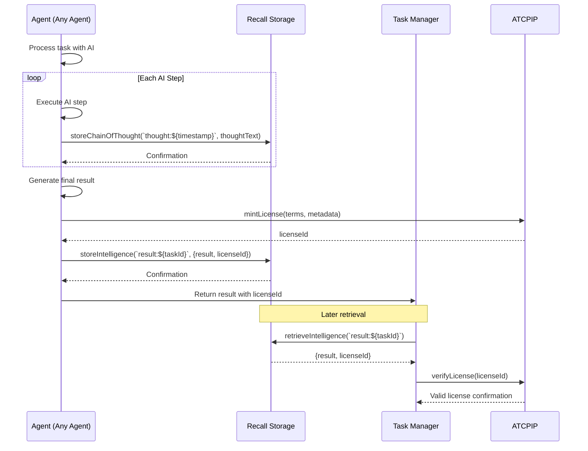

## 🤖 Ava the MultiChain Autonomous DeFai Portfolio Managing AI Agent

> Group of Multiple specialized autonomous AI agents with powerful tools that work together in collaberation to analyze, recommend, and execute the most optimal DeFi strategies while maintaining user-defined risk parameters and portfolio goals currently live on Hedera , Flow , Sui , Base Avalanche , Mode , Arbitrium , powered by Brian AI and LangChain.

## 🎯 Problem Statement
Managing DeFi portfolios across multiple protocols across different chains can be complex and time-consuming.

Users need to:
- Monitor multiple positions across different protocols
- Execute complex multi-step transactions
- Stay updated with the latest crosschain yield opportunities
- Maintain desired portfolio allocations
- React quickly to market changes

## 💡 Solution
An autonomous group of AI agents that manages your Multichain DeFi portfolio by:
- Understanding high-level goals in natural language
- Breaking down complex operations into executable steps
- Automatically executing transactions when needed
- Providing real-time updates and progress tracking
- Maintaining portfolio balance according to user preferences

## 🏗 Architecture

## Code Implementation

### Hedera Agent 

### Eigenlayer AVS for Verification of the Agentic Responses

- 

### Flow Agent 

### 

###  Story Protocol (IP Licensing )

- Made an atcp-ip based plugin for any agent to mint the IP on the story protocol and utilise the 

-> https://github.com/kamalbuilds/ethdenver2025/blob/master/server/src/agents/plugins/atcp-ip/index.ts

This architecture enables a sophisticated knowledge economy where agents can create, license, and exchange intellectual property while maintaining proper attribution and compensation mechanisms.

## Key Components and Interactions

1. **EventBus**
   - Central communication hub between components
   - Handles events between agents and UI

2. **Agents** (TaskManager, Observer, Executor, Hedera, CDP)
   - Execute specific tasks with ATCP/IP integration
   - Create IP from outputs and mint licenses
   - Store intelligence and chain of thought

3. **ATCP/IP Provider**
   - Creates license terms using the Story Protocol format
   - Interacts with Story Protocol Client to mint licenses
   - Handles license verification and royalty payments

4. **Recall Storage**
   - Stores intelligence data with license references
   - Provides persistent memory across agent operations
   - Manages chain of thought logging

5. **Story Protocol Client**
   - Handles blockchain interactions for IP registration
   - Manages license terms and royalty structures
   - Validates IP ownership and usage rights

The integration provides several key capabilities:

1. **IP Protection & Monetization**
   - All valuable outputs are properly licensed
   - Usage terms and royalties are tracked
   - Agents can monetize their outputs

2. **Knowledge Storage & Retrieval**
   - Chain of thought logging for process transparency
   - Intelligence data indexed with license references
   - Persistent memory across agent interactions

3. **Collaborative IP Management**
   - Clear IP ownership tracking
   - License verification for usage rights
   - Royalty payment processing

